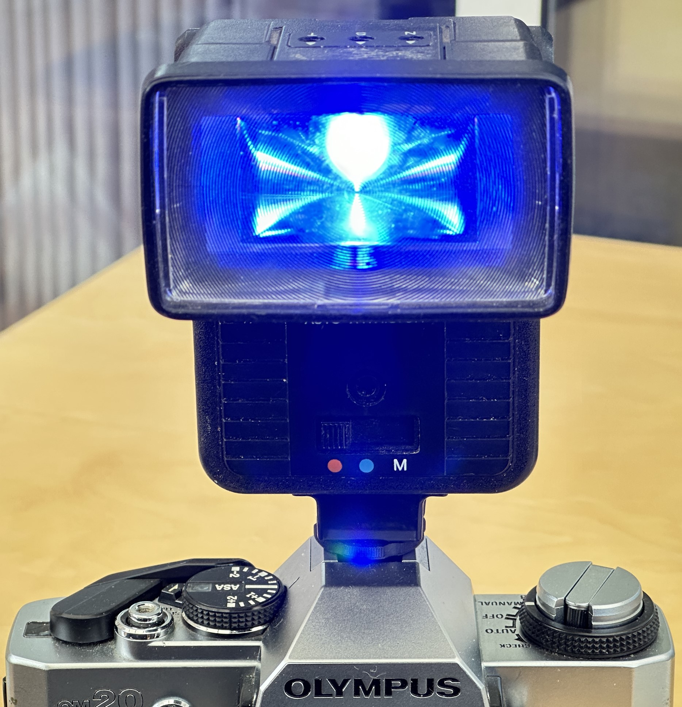
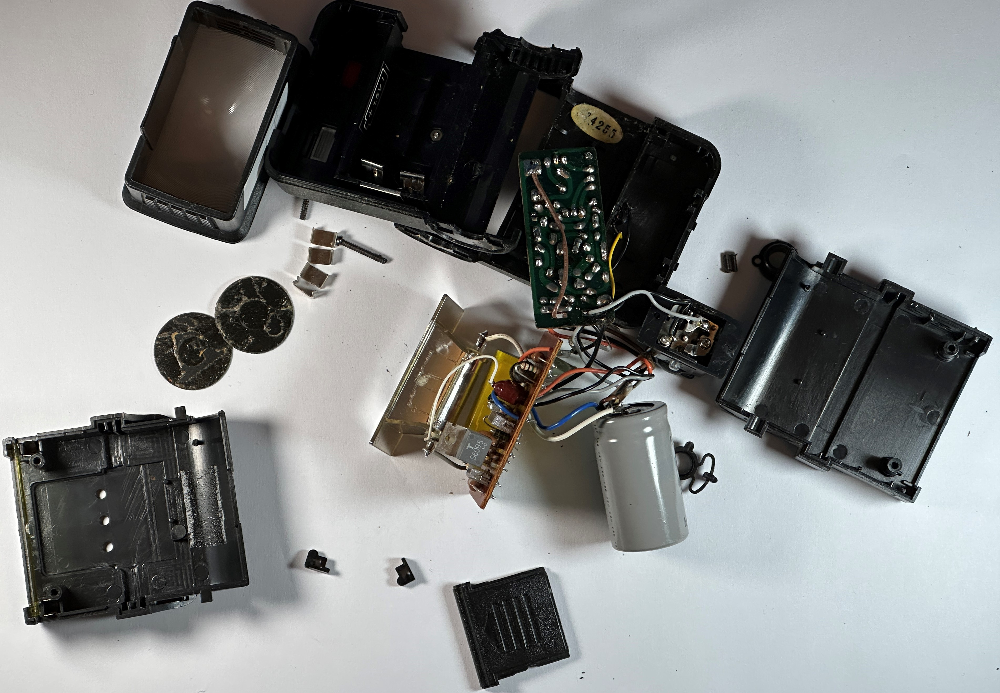
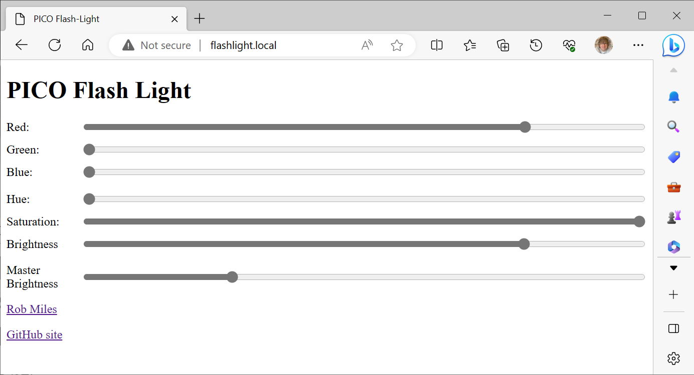
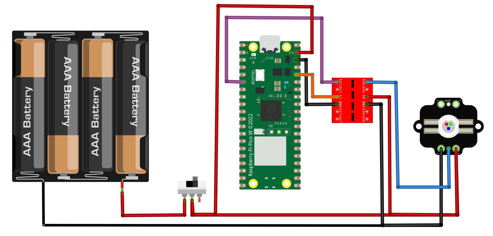

# PICO-Flash-Light
A browser controlled light powered by PICO-W



This is the flashgun light in use on a camera, providing an interesting blue light.
## *IMPORTANT NOTE
The flashlight uses four AA batteries with a nominal output of 1.5 volts each. However, if you use brand-new, shiny batteries this can cause the supply voltage to exceed the maximum voltage for the PICO. This doesn't cause any damage - the PICO just doesn't do anything. You can fix the problem by using rechargeable batteries (these only put out 1.2 volts) or using batteries that have already had some use.

## Upcycling an old flashgun



The flash light was created by upcycling a broken flash gun purchased from a market stall. You could use the same technique to create your own updated device. The flash gun contains a battery holder for 4 AA batteries delivering 6 volts in total (although this can cause problems - see above).

You will need:

* An old flash gun (or you can put the light into anything you fancy).
* A Raspberry Pi PICO W.
* A bright light. You can use a super bright neopixel or a Pixie 3w led. The author used the [Pixie](https://www.adafruit.com/product/2741) as this has overheat detection. 
* A level converter chip (search for “arduino level shifter” on your favourite ecommerce site).

## Web Site Host

The PICO hosts a web page that is used to set the colour and brightness of the light. The web site is held in the *site* folder in the *PICO files* folder. 

## Circuit Diagram



The version I made uses the power switch from the original flashgun to turn the power on and off. 
### Using a neopixel instead of a Pixie
If you want to use a neoPixel you can use exactly the same wiring but you need to modify the code at line 15 in the code:

```
neoPixels = False
```

Change the value to True.

## Software Installation

Install Circuit Python 8.0 on your PICO and connect the PICO to your PC. Now copy the contents of the "PICO files" folder in this repository onto the root of the PICO device. When you power on the PICO it will then run the code. 
## Configuring Wifi on the PICO
The PICO code uses the settings.toml file to configure the WiFi connection for the light. You will need to create this file and store it on your PICO-W. The settings are as follows

```
CIRCUITPY_WIFI_SSID="My SID"
CIRCUITPY_WIFI_PASSWORD="My Password"
CIRCUITPY_WEB_API_PORT=80
```
Have fun

Rob Miles